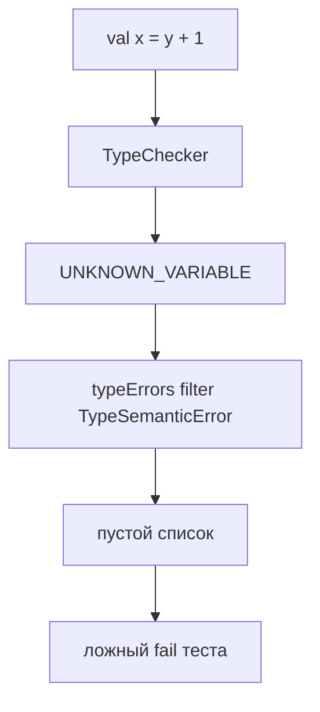

# Анализ и план: TODO-тесты в TypeCheckerTest (только тесты)

## Ограничение

**TypeChecker и прочий production-код менять нельзя.** Допустимы только изменения в [`TypeCheckerTest.kt`](src/test/kotlin/org/nnezh/semantic/TypeCheckerTest.kt) (и при необходимости комментарии/TODO в docs — опционально).

---

## Диагноз

### Проблема, которую можно закрыть тестами — фильтр хелперов

Pathological-тесты используют `typeErrors()` / `assertTypeCheckSurvives`, которые оставляют только `TypeSemanticError`:

```kotlin
private fun typeErrors(src: String): List<SemanticError.TypeSemanticError> =
    typeCheck(src).filterIsInstance<SemanticError.TypeSemanticError>()
```

TypeChecker при forward/circular reference возвращает **`VariableScopeSemanticError(UNKNOWN_VARIABLE)`** — analyzer не падает, но тест видит пустой список и падает с «expected at least one type error».



**Решение:** pathological-хелперы должны смотреть на **все** `SemanticError` из `typeCheck()`.

### Проблемы, которые тестами только документируем (TypeChecker не трогаем)

| Сценарий | Фактическое поведение TypeChecker | Ранее желаемое | Что делать в тестах |
|----------|----------------------------------|----------------|---------------------|
| `val a: Int = a + 1` | **0 ошибок** (имя в scope до initializer) | UNKNOWN_VARIABLE | Не assert `isNotEmpty()`; `assertDoesNotThrow` + комментарий **known gap** |
| `takeInt(foo)` / `return foo` (только функция) | **UNKNOWN_VARIABLE** | FUNCTION_IS_USED_AS_VARIABLE | Assert **UNKNOWN_VARIABLE** (вы сами отметили, что это логично) |
| forward / mutual / global circular | UNKNOWN_VARIABLE | UNKNOWN_VARIABLE | Assert UNKNOWN_VARIABLE после fix хелперов |

---

## Таблица TODO-тестов → новые ожидания

| Тест | Действие в тесте |
|------|------------------|
| `mutual circular initializers in same block` | `assertHasError(UNKNOWN_VARIABLE, VariableExpressionNode, ...)` |
| `circular initializers through arithmetic` | то же |
| `global circular initializers` | то же |
| `forward reference initializer before declaration` | UNKNOWN_VARIABLE на `y` |
| `initializer uses call that references later variable` | UNKNOWN_VARIABLE на `tail` |
| `function name used as value when no variable binding exists` | UNKNOWN_VARIABLE на `foo` |
| `function name passed to user function expecting int` | UNKNOWN_VARIABLE на `callback` |
| `function name as nested call argument at depth three` | UNKNOWN_VARIABLE на `leaf` |
| `return function identifier when only function exists` | UNKNOWN_VARIABLE на `foo` |
| `self reference in initializer is rejected without crashing` | только `assertDoesNotThrow`; **не** требовать ошибку; комментарий: known gap, intended UNKNOWN_VARIABLE когда TypeChecker будет доработан |

---

## Изменения (только TypeCheckerTest)

### 1. Новые хелперы

```kotlin
private fun allErrors(src: String): List<SemanticError> = typeCheck(src)

private fun scopeErrors(src: String): List<SemanticError.VariableScopeSemanticError> =
    allErrors(src).filterIsInstance()

private fun assertTypeCheckSurvives(src: String): List<SemanticError> {
    var result: List<SemanticError> = emptyList()
    assertDoesNotThrow { result = allErrors(src) }
    return result
}

private fun assertSurvivesWithAtLeastOneError(src: String) {
    assertTrue(allErrors(src).isNotEmpty(), "expected at least one semantic error")
}

private fun assertHasScopeError(
    errorType: SemanticErrorType,
    where: Class<out ASTNode>,
    src: String,
) {
    val errors = scopeErrors(src)
    assertTrue(
        errors.any { it.errorType == errorType && where.isInstance(it.where) },
        "expected $errorType at ${where.simpleName}, got: ${errors.map { it.errorType to it.where::class.simpleName }}",
    )
}
```

- `typeErrors()` / `assertNoTypeErrors` / `assertSingleTypeError` — **без изменений** (positive и type-negative тесты)
- `assertSurvivesWithAtLeastOneError` — перевести на `allErrors`

### 2. Обновить pathological-тесты

- Убрать все `// TODO:` комментарии
- Заменить `assertSurvivesWithAtLeastOneError` на `assertHasScopeError(UNKNOWN_VARIABLE, VariableExpressionNode::class.java, ...)` где применимо
- `self reference in initializer` — ослабить до robustness-теста без требования диагностики

### 3. Known gap — self-reference

В тесте явно зафиксировать:

```kotlin
@Test
fun `self reference in initializer does not crash`() {
    assertDoesNotThrow { allErrors("""...""") }
    // Known gap (TypeChecker): val a = a + 1 produces no error today.
    // Intended when TypeChecker is fixed: UNKNOWN_VARIABLE on VariableExpressionNode.
}
```

Не добавлять `@Disabled` — тест остаётся полезным как anti-NPE guard.

---

## Что не делаем

- **TypeChecker.kt** — без изменений
- **FUNCTION_IS_USED_AS_VARIABLE** — не assert'им, пока production не эмитит
- **docs/semantic_analysis_draft.md** — опционально; не блокирует прохождение тестов
- Positive type-тесты — не трогаем

---

## Проверка

```bash
./gradlew test --tests "org.nnezh.semantic.TypeCheckerTest"
```

Ожидаемо: TODO-marked pathological-тесты проходят; `self reference` — проходит как no-crash; оставшиеся падения (если есть) — другие known gaps TypeChecker, не связанные с фильтром хелперов.
