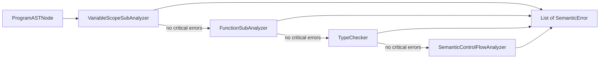

# bred — Semantic Analysis (Draft)

Technical reference for **semantic checks after AST construction**. Not part of the grammar (`docs/grammar.md` covers syntax only).

**Source of truth for behavior (tests):**

| Analyzer | Test file |
|----------|-----------|
| `VariableScopeSubAnalyzer` | `src/test/kotlin/org/nnezh/semantic/VariableScopeAnalyzerTest.kt` |
| `FunctionSubAnalyzer` | `src/test/kotlin/org/nnezh/semantic/FunctionAnalyzerTest.kt` |
| `TypeChecker` | `src/test/kotlin/org/nnezh/semantic/TypeCheckerTest.kt` (intended semantics; failures track gaps) |
| `SemanticControlFlowAnalyzer` | no dedicated test file (behavior covered indirectly) |
| Full pipeline | `SemanticAnalyzer` (sequential orchestration) |

**Implementation:**

| Component | File |
|-----------|------|
| Orchestrator | `src/main/kotlin/org/nnezh/semantic/SemanticAnalyzer.kt` |
| Visitor base | `src/main/kotlin/org/nnezh/semantic/generic/SemanticSubAnalyzer.kt` |
| Variable scope | `src/main/kotlin/org/nnezh/semantic/analyzers/VariableScopeSubAnalyzer.kt` |
| Function registry | `src/main/kotlin/org/nnezh/semantic/analyzers/FunctionSubAnalyzer.kt` |
| Type checking | `src/main/kotlin/org/nnezh/semantic/analyzers/TypeChecker.kt` |
| Control flow | `src/main/kotlin/org/nnezh/semantic/analyzers/SemanticControlFlowAnalyzer.kt` |
| Errors | `src/main/kotlin/org/nnezh/semantic/generic/SemanticError.kt` |
| Types | `src/main/kotlin/org/nnezh/base/Types.kt` |

---

## Pipeline

`SemanticAnalyzer` runs **four** passes **sequentially**. Passes 1–3 short-circuit on critical errors; pass 4 runs if pass 3 produced no critical errors.



1. **Variable scope** — name resolution, redeclaration, overshadowing, array index variables in assignments.
2. **Functions** — registry, arity at call sites, duplicate signatures.
3. **Types** — expression type inference (side table), compatibility checks; uses `FunctionSubAnalyzer.registry` for overload resolution by argument types.
4. **Control flow** — return-path / explicit-return expectations per function (`SemanticControlFlowAnalyzer`).

The AST (`org.nnezh.ast`) is **never modified**. Inferred expression types are stored in `ASTNodeTypeTable` (`IdentityHashMap<ExpressionASTNode, Type>`).

---

## Inputs / Outputs

- **Input:** `ProgramASTNode`.
- **Output:** `List<SemanticError>` (all passes combined).

### Error taxonomy

| Wrapper | `SemanticErrorType` values |
|---------|---------------------------|
| `VariableScopeSemanticError` | `UNKNOWN_VARIABLE`, `VARIABLE_REDECLARATION`, `VARIABLE_OVERSHADOW` |
| `FunctionSemanticError` | `FUNCTION_NOT_FOUND`, `FUNCTION_EXISTS_BUT_WRONG_ARGUMENTS_AMOUNT`, `REDEFINE_FUNCTION` |
| `TypeSemanticError` | `TYPE_CHECKER_INCOMPATIBLE_TYPES`, `TYPE_CHECKER_INCONSISTENT_ARRAY_TYPE`, `ARRAY_INDEX_IS_NOT_INTEGER`, `INVALID_AMOUNT_OF_ARGUMENTS_IN_ARRAYS_INITIALIZATION`, `METHOD_HAS_WRONG_RETURN` |
| `ControlFlowSemanticError` | `EXPLICIT_RETURN_IS_EXPECTED` |

`FUNCTION_IS_USED_AS_VARIABLE` exists in the enum but is **not emitted** (legacy).

All current semantic errors use `isCriticalError = true`.

---

## 1. Variable scope (`VariableScopeSubAnalyzer`)

### Responsibilities

- Lexical scoping for variables (`val` / `var` / function parameters).
- Forbid redeclaration in the same scope.
- Forbid overshadowing names from parent scopes.
- Detect unknown variable uses.

### Scope model

- **Scope:** `name → VariableDeclaration(name, type, isMutable)`.
- **Lookup** returns `(declaration, isCurrentScope)`.
- **Scopes created for:** globals, each function body (args + block), each nested block (`if`/`while`/`for` desugared content).

### Traversal policy

- **Within one statement:** collect **all** errors (e.g. multiple `UNKNOWN_VARIABLE` in one initializer).
- **Within a block:** sequential statements; stop after first statement with a critical error.
- **`if` / `while`:** if condition has critical error, body not analyzed.
- **Binding:** variable added to scope only if its declaration produced no critical errors.

### Diagnostics

#### `UNKNOWN_VARIABLE` (critical)

Unresolved name in `VariableExpressionNode`, unknown assignment target, or RHS expressions.

#### `VARIABLE_REDECLARATION` (critical)

Second declaration of the same name in the **current** scope (`lookUp(...).second == true`).

#### `VARIABLE_OVERSHADOW` (critical)

Declaration hides a name from a **parent** scope (global, outer local, or function argument vs global).

### Not implemented

- Assignment to immutable `val` (`G-32` in `docs/TODO.md`).

### Test coverage map

| Behavior | Test name (abbrev.) |
|----------|---------------------|
| Unknown in `return` | `unknown variable in expression is critical` |
| Unknown assignment target | `unknown variable in assignment is critical` |
| Unknown in initializer | `unknown variable in initializer is unknown variable not uninitialized` |
| Multiple unknowns in initializer | `unknown variables in initializer are all reported as unknown` |
| OVERSHADOW + unknowns in one statement | `returns all errors found inside statement but stops after critical statement` |
| Valid `var` init with global + param | `mutable variable initializer can use global constant and parameter` |
| Multiple unknowns in assignment RHS | `assignment reports all unknown variables in expression` |
| Stop after critical statement | `calc function reports only unknown identifiers in invalid reassignment` |
| Unknowns in call arguments | `function call reports all unknown variables in arguments` |
| `var` reassignment | `mutable variable can be reassigned after initialization` |
| `if` condition short-circuit | `critical error in if condition prevents analyzing then block` |
| REDECLARATION | `redeclaring name in same scope is critical` |
| OVERSHADOW in nested block | `shadowing variable in nested block is critical` |
| OVERSHADOW function arg | `shadowing function argument over global is critical` |
| OVERSHADOW local over global | `shadowing local variable over global is critical` |
| Outer scope visible inside block | `variable from outer scope is visible inside nested block` |
| Inner scope not visible outside | `variable declared in if/while block is not visible outside`, `for counter variable is not visible after loop` |

---

## 2. Function registry (`FunctionSubAnalyzer`)

### Responsibilities

- Register built-ins (`BuiltInMethods`) and user `fun` declarations.
- Check call sites: function exists, arity matches some overload.
- Forbid duplicate signatures (`name + parameter types`; return type excluded).
- Allow function and variable names to coexist (syntactic disambiguation).

### Signature identity

```ebnf
signatureKey ::= name '(' paramType { ',' paramType } ')' ;
```

| Case | Allowed |
|------|---------|
| Same name, different arity | yes |
| Same name, same arity, different parameter types | yes |
| Same name, same parameter types, different return type | no → `REDEFINE_FUNCTION` |
| Same name, same parameter types, different parameter names only | no → `REDEFINE_FUNCTION` |

```bred
fun foo(x: Int): Unit { }
fun foo(x: String): Unit { }        // ok

fun foo(x: String): Unit { }
fun foo(x: String): String {       // REDEFINE_FUNCTION
    return x
}
```

### Traversal policy

- Register all functions first; then analyze globals and bodies.
- **No block short-circuit** (unlike variable scope).
- On `REDEFINE_FUNCTION` during registration, analysis **stops entirely** (`G-33`).

### Diagnostics

| Error | When | `where` |
|-------|------|---------|
| `FUNCTION_NOT_FOUND` | Call to unknown name | `FunctionCallExpressionNode` |
| `FUNCTION_EXISTS_BUT_WRONG_ARGUMENTS_AMOUNT` | Name exists, no overload with matching arity | `FunctionCallExpressionNode` |
| `REDEFINE_FUNCTION` | Duplicate `signatureKey` (incl. builtins) | `ProgramASTNode` (should be duplicate decl — `G-33`) |

**Note:** this pass does **not** check argument types at call sites; that is `TypeChecker`.

### Function / variable name coexistence

| Surface form | Resolved as | Analyzer |
|--------------|-------------|----------|
| `ident(...)` | function call | `FunctionSubAnalyzer` + `TypeChecker` |
| `ident` in expression | variable | `VariableScopeSubAnalyzer` + `TypeChecker` |
| `val ident` / `var ident` | variable declaration | scope + type init check |

### Test coverage map

| Behavior | Test name (abbrev.) |
|----------|---------------------|
| Valid arity | `valid call with matching arity` |
| Types not checked at arity pass | `argument types are not checked` |
| Overload by arity | `overload by arity is allowed`, `different arity is not redefine` |
| Overload by parameter types | `overload by parameter types is allowed` |
| Redefine same param types | `duplicate user function same arity`, `duplicate same parameter types different return type is redefine`, `duplicate same parameter types implicit Unit and explicit return type is redefine`, `redefine builtin with same arity` |
| Forward reference | `forward reference between functions` |
| Builtin call | `builtin call is valid` |
| Call in RHS / nested / statement | `call in assignment RHS`, `nested call in arguments`, `statement-level call` |
| Unknown function | `unknown function is critical` |
| Wrong arity | `too few arguments`, `too many arguments`, `zero args when one required`, `builtin wrong arity` |
| Same name coexistence | `global val and function with same name`, `local val and function with same name`, … |
| Arity error + arg walk | `wrong arity and unknown args in same call both reported` |
| Redefine early abort | `redefine stops entire program analysis early` |

---

## 3. Type checking (`TypeChecker`)

### Responsibilities

- Infer type of each `ExpressionASTNode` visited; store in `ASTNodeTypeTable` (identity map, AST unchanged).
- Check compatibility: initializers, assignments, `if`/`while` conditions, `return` vs function result type, function call argument types vs registry.

### Supporting types

```kotlin
class ASTNodeTypeTable {
    // IdentityHashMap<ExpressionASTNode, Type>
    fun put(node: ExpressionASTNode, type: Type)
    fun get(node: ExpressionASTNode): Type?
}

class TypeScope(parentScope, typeTable) {
    // variable name → Type (lexical, mirrors scope structure)
    // delegates expression lookup to typeTable + parent
}

class TypeValidator {
    fun check(typeA, typeB): Boolean           // structural equality ==
    fun checkUnaryOperation(op, operandType)    // "-" → Int only; "!" → Boolean only
    fun produceBinaryType(op, left, right)      // same-type rule (see limitations)
}
```

`TypeChecker` receives `FunctionRegistry` from `FunctionSubAnalyzer` (shared built-ins + user signatures).

### Intended operator typing rules

Tests in `TypeCheckerTest` define **target** behavior (not current implementation). Operator result types:

| Operators | Operand type(s) | Result type |
|-----------|-----------------|-------------|
| `%` | `Int`, `Int` | `Int` |
| `%` | `Double`, `Double` | **rejected** (modulo is Int-only) |
| `+` `-` `*` `/` | `Double`, `Double` | `Double` |
| `==` `!=` `<` `>` `<=` `>=` | same numeric type (`Int`/`Int` or `Double`/`Double`) | `Boolean` |
| `==` `!=` | `String`, `String` | `Boolean` |
| `&&` `\|\|` | `Boolean`, `Boolean` | `Boolean` |
| `-` (unary) | `Int` | `Int` |
| `-` (unary) | `Double` | `Double` |
| `!` (unary) | `Boolean` | `Boolean` |

**Rejected (must produce `TYPE_CHECKER_INCOMPATIBLE_TYPES`):**

- mixed numeric without promotion (`Int` + `Double`, `Int` == `String`)
- arithmetic/logical on wrong types (`true + false`, `1 && 0`, `-"x"`, `!1`)
- non-boolean `if` / `while` conditions
- initializer/assignment/return type mismatch
- call with no overload matching inferred argument types (incl. builtins)

**Numeric promotion:** not supported — `Int` and `Double` are incompatible in binary ops.

### Expression type inference

| Node | Inferred type |
|------|---------------|
| `IntLiteralExpressionNode` | `IntType` |
| `DoubleLiteralExpressionNode` | `DoubleType` |
| `BooleanLiteralExpressionNode` | `BoolType` |
| `StringLiteralExpressionNode` | `StringType` |
| `VariableExpressionNode` | type from `TypeScope` by name |
| `BinaryExpressionASTNode` | per operator table above |
| `UnaryExpressionASTNode` | per operator table; result **must** be stored on the unary node |
| `FunctionCallExpressionNode` | `returnType` of the resolved overload; args must match signature |
| `ArrayAccessExpressionASTNode` | element type of `StaticArrayType`; index must be `Int` |
| `StaticArrayInitializationExpressionsListNode` | unified element type of all values |

All inferred expression types are recorded in `ASTNodeTypeTable` (identity map).

### Arrays (semantic)

| Scenario | `SemanticErrorType` | `where` |
|----------|---------------------|---------|
| Init list mixed element types | `TYPE_CHECKER_INCONSISTENT_ARRAY_TYPE` | `StaticArrayInitializationExpressionsListNode` |
| Non-integer index | `ARRAY_INDEX_IS_NOT_INTEGER` | `ArrayAccessExpressionASTNode` |
| `size != values.size` on init | `INVALID_AMOUNT_OF_ARGUMENTS_IN_ARRAYS_INITIALIZATION` | `StaticArrayExpressionNode` |
| `arr[0] = incompatible` | `TYPE_CHECKER_INCOMPATIBLE_TYPES` | `AssignmentStatementASTNode` |
| Unknown array name | `UNKNOWN_VARIABLE` | `ArrayAccessExpressionASTNode` or `AssignmentStatementASTNode` |
| `val arr: Int[n] = [1, 2]` | no type errors when element types match | — |

Tests: `TypeCheckerTest` region **Arrays**, `VariableScopeAnalyzerTest` region **Arrays**.

### Statement / declaration checks

| Construct | Check |
|-----------|-------|
| `VariableInitializationASTNode` | scalar: `variableType == infer(valExpression)`; static array: element type == init-list unified type; size == list length |
| `AssignmentStatementASTNode` | `infer(lvalue) == infer(rvalue)`; array lvalue → element type |
| `IfStatementASTNode` / `WhileStatementASTNode` | `infer(condition) == BoolType` |
| `DeclareFunctionASTNode` | `resultType == type(first ReturnFunctionStatementASTNode in body)` |
| `FunctionCallExpressionNode` | inferred arg types match a registered signature |

### Traversal policy

- Analyze globals, then functions (same visitor shape as other analyzers).
- **Block short-circuit:** stop block on first critical error (like variable scope).
- **Binary:** short-circuit on critical error in left operand before analyzing right.

### Diagnostic

#### `TYPE_CHECKER_INCOMPATIBLE_TYPES` (critical)

Emitted when types do not match. `where` points to the offending node:

- `VariableInitializationASTNode` — initializer mismatch
- `BinaryExpressionASTNode` — operand types differ
- `AssignmentStatementASTNode` — assignment mismatch
- `IfStatementASTNode` / `WhileStatementASTNode` — non-boolean condition
- `DeclareFunctionASTNode` — return type mismatch
- `FunctionCallExpressionNode` — no overload for inferred argument types
- `UnaryExpressionASTNode` — invalid unary operand type

### Known gaps (implementation vs intended tests)

`TypeCheckerTest` is the specification for target behavior. As of the latest run, **many tests intentionally fail** until `TypeChecker` / `TypeValidator` are completed.

| Gap | Intended | Current implementation |
|-----|----------|------------------------|
| Comparison/logical operators | `==`, `<`, `&&` → `Boolean` | `produceBinaryType` returns operand type when equal |
| Unary `-` / `!` | result typed on unary node | operand checked only; unary node often untyped → NPE downstream |
| Unary `-` on `Double` | allowed | `checkUnaryOperation` allows `Int` only |
| Call result type | store callee `returnType` on call node | not stored |
| `if` condition error | short-circuit then-block | then-block still analyzed |
| Return analysis | all paths / nested returns | per-return checks in `analyzeReturnFunctionStatementASTNode`; redundant top-level-only check removed |
| Static array init | element type match, size check | fixed in `TypeChecker` (G-37) |
| Array index in assign scope | index variables resolved | fixed in `VariableScopeSubAnalyzer` (G-40) |
| `FunctionRegistry.getResultType` | positional arg equality | fixed (G-41) |
| Multiple errors in one expr | report incompatible comparison | may report on wrong node |
| Cyclic / forward initializers | diagnostic, no crash | some cases **throw** (NPE); `val a = a + 1` may report **no** error |
| Function as value | `takeInt(foo)` when only `fun foo()` exists → error, no crash | **throws** on bare function identifier in value position |
| First-class functions | not supported | function name may be treated as unknown variable or crash |

### Pathological cases (intended robustness)

These are **stress tests** for `TypeChecker` — the analyzer must always finish with diagnostics, never throw:

| Scenario | Expected behavior |
|----------|-------------------|
| `val a: Int = a + 1` | At least one type error (cyclic/forward use) |
| `val a = b; val b = a` (same block or globals) | At least one error |
| `val x = y + 1` before `val y = 10` | At least one error |
| `takeInt(foo)` when only `fun foo(): Unit` exists | Error — no first-class functions |
| `return foo` when `foo` is only a function | Error |
| `outer(mid(leaf))` with `leaf(): Unit`, `mid(x: Int): Int` | Error at inner/outer call |
| Deep nesting (`if` × 7, `if`/`while`/`for` stack) | Reach innermost error without stack overflow |
| Mutual recursion with wrong arg type | Error on offending call |
| Second `return` wrong type after valid `return` | Error on all return paths |

Helper `assertTypeCheckSurvives` / `assertSurvivesWithAtLeastOneError` enforce **no throw + at least one diagnostic** for the worst cases.

### Test coverage map

`TypeCheckerTest` — **~116 tests** (intended semantics; region **Arrays** specifies target array behavior).

| Category | Examples |
|----------|----------|
| Literals / scope | `all primitive literals match their annotations`, `global val initializer is type-checked`, `nested block sees outer variable type` |
| Arithmetic / compare | `int arithmetic chain`, `int comparison produces boolean`, `double comparison produces boolean` |
| Logical / unary | `logical and and or require boolean operands`, `unary minus on int`, `unary minus on double`, `unary not on boolean`, `nested unary and binary` |
| Control flow | `if and else with boolean condition from expression`, `while with boolean expression condition` |
| Returns | `function returns expression of correct type`, `function returns call result`, `implicit Unit function with empty body` |
| Calls | `builtin stringConcat`, `stringEquals`, overload `foo(Int)` / `foo(String)`, `multi argument user function` |
| Negative init/assign | `boolean assigned to int`, `int comparison assigned to int`, `string to int`, `global val mismatch`, `assignment to var` |
| Negative operators | `int + double`, `int + string`, `int == string`, `1 && 0`, `true + false`, `!1`, `-true`, `-"x"` |
| Negative control flow | `if (1)`, `if ("yes")`, `while (42)` |
| Negative calls/returns | wrong return type, wrong overload, `println(42)`, `stringConcat("a", 1)` |
| Traversal edges | block short-circuit, if condition short-circuit, multiple errors in comparison |
| Deep nesting positive | `deeply nested arithmetic with precedence`, `chained comparisons and logical operators`, `triple nested unary and comparison`, `nested if else with boolean guards`, `while nested in if`, `for loop body with int arithmetic`, nested calls, builtin chains, `function and variable same name` |
| Deep nesting negative | nested non-boolean `if`, outer wrong `if` short-circuit, wrong type in parentheses, logical chain with int, comparison in arithmetic, nested wrong calls (3 levels), `substring` wrong index type, for/while/else body errors |
| Multi-function | `forward reference call chain`, fail-fast vs independent function checks |
| **Arrays** | `static array with matching initialization list`, `array read with int index`, `incompatible type in array element assignment`, init list inconsistent types, non-integer index, size mismatch |
| **Pathological** | cyclic initializers (self/mutual/global/forward), function-as-argument (bare name, nested depth 3, `return foo`), unit-in-arithmetic, builtin chain break, overload with no match, cascading wrong args, second return wrong type, assignment to param, 7-deep `if` nesting |

---

## 4. Control flow (`SemanticControlFlowAnalyzer`)

### Responsibilities

- Per-function return-path analysis after type checking.
- Detect implicit `return Unit` in non-`Unit` functions when explicit return is expected.

### Diagnostics

| Error | When | `where` |
|-------|------|---------|
| `EXPLICIT_RETURN_IS_EXPECTED` | Non-`Unit` function body terminates with implicit/synthetic return only | `BlockASTNode` |

Does not extend `SemanticSubAnalyzer`; uses a separate walker.

---

## Out of scope (entire semantic phase)

- Runtime semantics / code generation
- Type inference for `val x = expr` without annotation (`G-03`)
- Distinguishing `val a = a + 1` self-use from unknown variable (reported as `UNKNOWN_VARIABLE`)
- Full operator typing (comparison → `Bool`, arithmetic promotion)
- Assignment to immutable `val` (`G-32`)

---

## Open gaps (`docs/TODO.md`)

| ID | Item |
|----|------|
| G-32 | Assignment to immutable `val` |
| G-33 | `REDEFINE_FUNCTION` early abort + wrong `where` |
| G-34 | Align traversal policies across analyzers |
| G-35 | Function parameter names vs registry |
| G-09 | For-loop bound types |
| G-31 | Missing return on non-Unit functions (parser synthetic `return Unit`) |
| G-37 | Static array init: element type vs `StaticArrayType` mismatch |
| G-38 | Scalar rhs on array decl → parse error, not `ClassCastException` |
| G-39 | `val` static arrays: `isMutable = false` |
| G-40 | Array assignment: validate index expression in scope pass |
| G-41 | `FunctionRegistry.getResultType`: positional overload match |

TypeChecker-specific follow-ups (not yet in TODO): unary result typing, per-operator binary rules, call result types.
